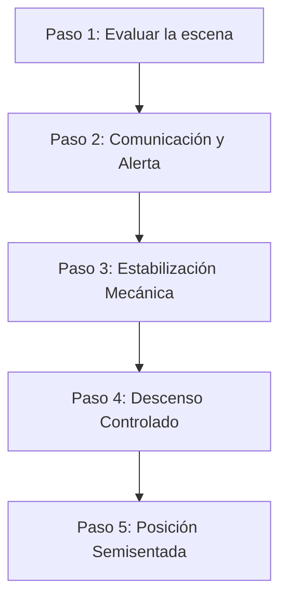

# GUIÓN DE SIMULACIÓN DE RESCATE (TRAUMA POR SUSPENSIÓN)
### NOM-009-STPS-2011 | Vértice EHS

---

## 1. OBJETIVO DE LA ACTIVIDAD
Simular una respuesta coordinada ante la caída de un trabajador que queda suspendido de su arnés a 4.5 m de altura. Los participantes deben actuar bajo presión para ejecutar el protocolo verbal de 5 pasos en un tiempo objetivo de **≤15 minutos** (idealmente en ≤5 minutos de simulación interactiva) para prevenir el síndrome de suspensión.

---

## 2. ROLES DE LA DINÁMICA
1.  **Participante 1 — Trabajador Suspendido (Luis):**
    *   Sufrió una caída desde un andamio al perder el equilibrio.
    *   Quedó suspendido inmóvil de la argolla dorsal de su arnés clase 3.
    *   Debe simular en cámara/micrófono los síntomas progresivos: hormigueo en piernas, mareo, palidez y desesperación.
2.  **Participante 2 — Rescatista/Vigía (Carlos):**
    *   Observa el accidente.
    *   Debe liderar la respuesta técnica y el aseguramiento físico de la escena.
3.  **Instructor (Vértice EHS) — Comunicador / Soporte Médico:**
    *   Activa el enlace de emergencias externas y cronometra el ejercicio.
    *   Introduce complicaciones al escenario (ej. "La línea de rescate se atoró", "¿Qué posición le darás al bajar?").

---

## 3. EL PROTOCOLO VERBAL DE 5 PASOS

### PASO 1: Evaluar la escena e Identificar peligro (0–1 min)
*   **Acción del Rescatista (Carlos):** *"¡Escena evaluada! No hay líneas eléctricas expuestas, no hay objetos cayendo. Zona segura para iniciar maniobras."*
*   **Propósito:** Evitar crear una segunda víctima por actuar con prisa.

### PASO 2: Comunicación y Alerta (1–2 min)
*   **Acción del Rescatista (Carlos):** *"¡Atención Comunicador/Instructor! Activa el Plan de Emergencias Médicas. Tenemos a Luis suspendido a 4.5 m de altura tras caída de andamio. Está consciente pero refiere mareos. Necesitamos ambulancia con soporte de trauma."*
*   **Acción del Comunicador (Instructor):** *"Entendido. Código Rojo activado. Brigada interna en camino, paramédicos notificados. Tiempo de arribo: 10 minutos."*

### PASO 3: Estabilización Mecánica (2–4 min)
*   **Acción del Rescatista (Carlos):** *"Luis, mantén la calma. Si puedes, usa las cintas de alivio de trauma en tus piernas para apoyarte y bombear sangre. Voy a anclar la línea de rescate auxiliar al punto de anclaje certificado sobre ti."*
*   **Acción del Suspendido (Luis):** *"Entendido... mis piernas se sienten dormidas. Estoy intentando pararme en las cintas de trauma."*

### PASO 4: Descenso Controlado (4–5 min)
*   **Acción del Rescatista (Carlos):** *"Línea de rescate conectada a tu argolla esternal/dorsal. Inicio el descenso mecánico de forma lenta y controlada usando el descensor autofrenante. Prepárate para tocar el suelo."*
*   **Propósito:** Un descenso brusco puede provocar una embolia o colapso cardíaco debido al retorno masivo de sangre desoxigenada acumulada en las piernas.

### PASO 5: Posición Semisentada (5+ min)
*   **Acción del Rescatista (Carlos):** *"Luis ya está en el suelo. ¡Atención! Queda estrictamente PROHIBIDO acostarlo boca arriba. Lo colocamos en POSICIÓN SEMISENTADA (con las rodillas dobladas hacia el pecho) para asegurar un retorno venoso paulatino al corazón."*
*   **Propósito:** Evitar el "shock de reflujo" (muerte cardíaca súbita al liberar la presión de las perneras).

---

## 4. EVALUACIÓN DE LA DINÁMICA (RÚBRICA RÁPIDA)
El instructor calificará la dinámica en base a:
*   [ ] **Tiempo total:** ¿Se ejecutaron los 5 pasos verbales en ≤5 minutos?
*   [ ] **Seguridad del rescatista:** ¿Verificó la seguridad de la escena antes de intervenir?
*   [ ] **Instrucción al suspendido:** ¿Le indicó usar las cintas de alivio de trauma?
*   [ ] **Cuidado en el descenso:** ¿Explicó que el descenso debe ser controlado?
*   [ ] **Posición final:** ¿Colocó al trabajador en posición semisentada en el suelo? (Criterio crítico: reprobatorio si lo acuesta boca arriba).
